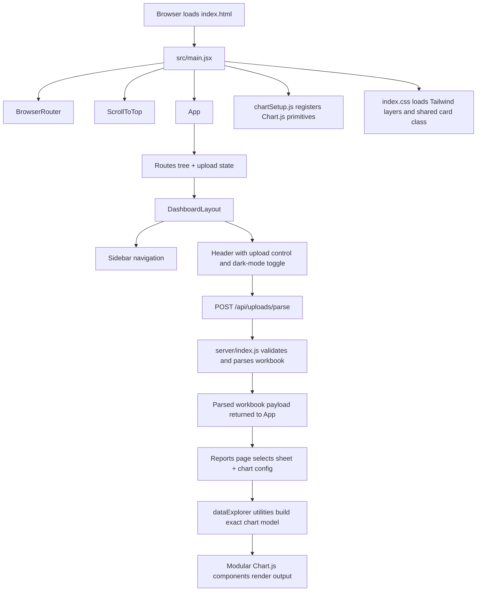
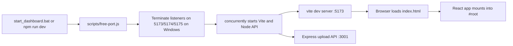
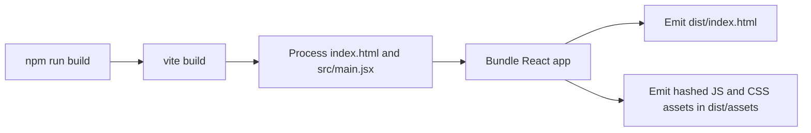
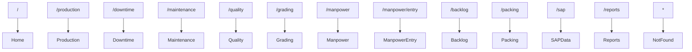

# FactoryOS Technical Documentation

## 1. System Summary

FactoryOS is a Vite-hosted React single-page application that renders a manufacturing operations dashboard and now includes a lightweight Node/Express upload API for spreadsheet ingestion. Core operations pages remain local and static, while the Reports page can now parse uploaded `.xlsx`, `.xls`, and `.csv` files and generate charts strictly from the parsed dataset. There is still no persistence layer, authentication layer, or server-side rendering path in the verified codebase.

## 2. Repository Structure

```text
FactoryOS/
|-- index.html
|-- package.json
|-- package-lock.json
|-- postcss.config.js
|-- tailwind.config.js
|-- vite.config.js
|-- start_dashboard.bat
|-- scripts/
|   `-- free-port.js
|-- server/
|   `-- index.js
|-- src/
|   |-- main.jsx
|   |-- App.jsx
|   |-- chartSetup.js
|   |-- index.css
|   |-- components/
|   |   |-- KPICard.jsx
|   |   |-- ScrollToTop.jsx
|   |   |-- FileUploadControl.jsx
|   |   `-- dataExplorer/
|   |       |-- ChartControls.jsx
|   |       |-- ChartRenderer.jsx
|   |       |-- MetricGrid.jsx
|   |       |-- ParsedDataPreview.jsx
|   |       `-- charts/
|   |           |-- BarChart.jsx
|   |           |-- LineChart.jsx
|   |           |-- PieChart.jsx
|   |           `-- ScatterChart.jsx
|   |-- layouts/
|   |   `-- DashboardLayout.jsx
|   |-- utils/
|   |   `-- dataExplorer.js
|   `-- pages/
|       |-- Home.jsx
|       |-- Production.jsx
|       |-- Downtime.jsx
|       |-- Maintenance.jsx
|       |-- Quality.jsx
|       |-- Grading.jsx
|       |-- Manpower.jsx
|       |-- ManpowerEntry.jsx
|       |-- Backlog.jsx
|       |-- Packing.jsx
|       |-- SAPData.jsx
|       |-- Reports.jsx
|       `-- NotFound.jsx
`-- dist/                Generated build output, not source-of-truth
```

## 3. Architecture



## 4. Runtime and Build Flow

### 4.1 Development startup



### 4.2 Production build



## 5. End-to-End Data Flow

There are now two verified data patterns:

### 5.1 Existing static dashboard flow

1. A route is selected by React Router.
2. `DashboardLayout` renders persistent navigation and header chrome.
3. The matching page component renders.
4. Most non-report pages construct local constants or local component state.
5. That local data is fed into JSX tables, KPI cards, and chart components.
6. Chart components consume pre-registered Chart.js primitives from `src/chartSetup.js`.

### 5.2 Spreadsheet upload and chart flow

1. The user selects a file from the header upload control in `DashboardLayout.jsx`.
2. `App.jsx` posts the file as multipart form data to `POST /api/uploads/parse`.
3. `server/index.js` validates file type and size, then parses each sheet with `xlsx`.
4. The API returns a workbook payload containing raw row arrays and inferred column metadata.
5. `App.jsx` stores the parsed workbook payload separately from upload status state.
6. `Reports.jsx` stores visualization configuration separately from the raw workbook payload.
7. `src/utils/dataExplorer.js` derives the chart model from the selected sheet, selected columns, selected chart type, and selected aggregation.
8. `src/components/dataExplorer/charts/*` render the final chart without mutating source rows.

There are still no context providers or reducers in the verified codebase. Cross-page shared state is limited to `darkMode`, `uploadedWorkbook`, and `uploadState` inside `App.jsx`.

## 6. Verified Module Behavior

### 6.1 Root and configuration files

| File | Category | Verified role |
| --- | --- | --- |
| `index.html` | USED | Provides the `#root` mount element and loads `/src/main.jsx`. |
| `package.json` | CRITICAL/INFRA | Defines dependencies and the `dev`, `build`, and `preview` scripts. |
| `package-lock.json` | CRITICAL/INFRA | Locks package resolution for reproducible installs. |
| `vite.config.js` | CRITICAL/INFRA | Enables React plugin, configures dev/preview ports, and proxies `/api` requests to `http://localhost:3001`. |
| `tailwind.config.js` | CRITICAL/INFRA | Defines Tailwind content scan targets, dark mode mode, and extended colors. |
| `postcss.config.js` | CRITICAL/INFRA | Wires Tailwind CSS and Autoprefixer into CSS processing. |
| `start_dashboard.bat` | USED | Windows entry script that installs dependencies and starts the frontend and upload API together via `npm run dev`. |
| `.gitignore` | CRITICAL/INFRA | Excludes `node_modules/`, `dist/`, logs, and `.DS_Store`. |

### 6.2 Scripts

| File | Category | Verified role |
| --- | --- | --- |
| `scripts/free-port.js` | USED | Invoked by `npm run dev`; on Windows it finds listeners on requested ports and terminates their PIDs before Vite starts. |
| `server/index.js` | USED | Express upload API that validates spreadsheet uploads, parses workbook sheets, infers column types, and returns JSON payloads for chart generation. |

### 6.3 Application bootstrap

| File | Category | Verified role |
| --- | --- | --- |
| `src/main.jsx` | USED | Mounts the React app, wraps it in `BrowserRouter`, injects `ScrollToTop`, and imports global chart/style setup. |
| `src/App.jsx` | USED | Owns `darkMode`, `uploadedWorkbook`, and `uploadState`, posts files to `/api/uploads/parse`, and declares the full route tree. |
| `src/chartSetup.js` | USED | Registers all Chart.js elements used by page charts. |
| `src/index.css` | USED | Loads Tailwind layers, defines light/dark body styling, and introduces a reusable `.card` component class. |

### 6.4 Shared UI

| File | Category | Verified role |
| --- | --- | --- |
| `src/layouts/DashboardLayout.jsx` | USED | Renders sidebar navigation, route outlet, shift label, global upload control, avatar stub, and dark-mode toggle. |
| `src/components/FileUploadControl.jsx` | USED | Hidden file input plus header upload button and upload status display for `.xlsx`, `.xls`, and `.csv` files. |
| `src/components/KPICard.jsx` | USED | Displays KPI title, value, unit, target, and icon with status color mapping. |
| `src/components/ScrollToTop.jsx` | USED | Resets scroll position on route change, preferring the main content scroll container when available. |
| `src/components/dataExplorer/ChartControls.jsx` | USED | Sheet-aware chart configuration controls for chart type, X-axis, Y-axis, and aggregation. |
| `src/components/dataExplorer/ChartRenderer.jsx` | USED | Dispatches the derived chart model to the correct chart component and shows validation errors safely. |
| `src/components/dataExplorer/MetricGrid.jsx` | USED | Displays computed upload/chart metrics without mutating source data. |
| `src/components/dataExplorer/ParsedDataPreview.jsx` | USED | Renders a bounded preview of the parsed sheet and column metadata. |
| `src/components/dataExplorer/charts/*` | USED | Reusable isolated chart components for bar, line, pie, and scatter visualizations. |
| `src/utils/dataExplorer.js` | USED | Houses chart-type inference, aggregation logic, value coercion for typed calculations, and visualization model construction. |

### 6.5 Route pages

| File | Category | Verified role |
| --- | --- | --- |
| `src/pages/Home.jsx` | USED | Plant overview dashboard with KPI cards, production trend, grade distribution, downtime summary, line status, and alert cards. |
| `src/pages/Production.jsx` | USED | Production page with shift/date filters, KPI cards, hourly trend, line-wise output, and line status table. |
| `src/pages/Downtime.jsx` | USED | Downtime page with KPI cards, pareto chart, and machine-wise incident table. |
| `src/pages/Maintenance.jsx` | USED | Maintenance page with machine state summaries, health doughnut chart, and PM tracker cards. |
| `src/pages/Quality.jsx` | USED | Quality page with KPI cards, yield trend chart, and defect distribution doughnut chart. |
| `src/pages/Grading.jsx` | USED | Grading page with grade summary cards and stacked grade trend bars. |
| `src/pages/Manpower.jsx` | USED | Manpower overview with navigation into the entry form, KPI cards, line cards, attendance chart, and utilization doughnut chart. |
| `src/pages/ManpowerEntry.jsx` | USED | Local-state manpower entry grid with editable required/present counts, derived shortage values, and aggregate totals. |
| `src/pages/Backlog.jsx` | USED | Backlog view with KPI cards, backlog bar chart, and pending order list. |
| `src/pages/Packing.jsx` | USED | Packing view with KPI cards, shift packing chart, and recent pallet table. |
| `src/pages/SAPData.jsx` | USED | Searchable SAP order table backed by local component state and hard-coded records. |
| `src/pages/Reports.jsx` | USED | Reports center plus uploaded-workbook sheet selection, configurable chart generation, summary metrics, and parsed-data preview. |
| `src/pages/NotFound.jsx` | USED | Catch-all route page for unmatched URLs. |

## 7. Route Map



## 8. State and Interaction Model

### 8.1 Global-ish UI state

- `App.jsx` owns `darkMode`.
- `App.jsx` also owns `uploadedWorkbook` and `uploadState`.
- `useEffect` in `App.jsx` adds or removes the `dark` class from `document.documentElement`.
- `DashboardLayout.jsx` toggles theme state through the header button.
- `FileUploadControl.jsx` invokes the upload handler exposed from `App.jsx`.

### 8.2 Route utility state

- `ScrollToTop.jsx` reads `pathname` from `useLocation`.
- On change, it scrolls the main content container back to the top, or the window if that container is absent.

### 8.3 Page-local state

- `ManpowerEntry.jsx` holds an editable array of row objects in `useState`.
- `SAPData.jsx` holds `searchTerm` in `useState` and derives `filteredOrders`.
- `Reports.jsx` holds `selectedSheetIndex` and `chartConfig` in `useState`.
- The raw workbook payload is not mutated inside `Reports.jsx`; only visualization selections change.

## 9. Inputs and Outputs By Module

### 9.1 `src/App.jsx`

- Inputs:
  - Browser route from React Router.
  - User clicks on the dark-mode toggle.
  - Uploaded spreadsheet file selected from the header.
- Outputs:
  - Selected page route element.
  - `dark` class on the root HTML element.
  - Parsed workbook JSON stored in local state.

### 9.2 `src/layouts/DashboardLayout.jsx`

- Inputs:
  - `darkMode`
  - `setDarkMode`
  - `onUpload`
  - `uploadState`
  - `workbook`
  - Active route from React Router.
- Outputs:
  - Sidebar navigation UI.
  - Header UI with upload control.
  - Routed page outlet.

### 9.3 `src/components/KPICard.jsx`

- Inputs:
  - `title`
  - `value`
  - `target`
  - `unit`
  - `status`
  - `icon`
- Outputs:
  - Rendered KPI card with status-colored icon and target footer when provided.

### 9.4 `src/components/ScrollToTop.jsx`

- Inputs:
  - `pathname`
- Outputs:
  - Scroll reset side effect.

### 9.5 `src/pages/Reports.jsx`

- Inputs:
  - `uploadedWorkbook`
  - `uploadState`
- Outputs:
  - Sheet selector.
  - Chart controls.
  - Derived metrics.
  - Modular chart render.
  - Parsed data preview.

### 9.6 API endpoints

| Endpoint | Method | Input | Output |
| --- | --- | --- | --- |
| `/api/health` | GET | None | `{ "status": "ok" }` |
| `/api/uploads/parse` | POST | Multipart form data with `file` | Parsed workbook payload or safe validation error JSON |

### 9.7 Page modules

Every page other than `Reports.jsx` still outputs JSX composed from:

- hard-coded KPI values,
- hard-coded chart datasets,
- hard-coded status labels and tables,
- optional local component state for form or filter UI.

## 10. Technology Stack and Rationale

| Technology | Verified use | Practical rationale in this codebase |
| --- | --- | --- |
| Vite | Dev server and production bundling | Fast React development setup with minimal configuration. |
| Express | Upload API | Lightweight backend surface for strict validation and spreadsheet parsing without disturbing the existing route structure. |
| React 18 | Component model and rendering | Suitable for composing dashboard sections and route pages from reusable JSX blocks. |
| React Router DOM 6 | SPA navigation | Clean nested route model with a shared dashboard shell and per-page outlets. |
| Tailwind CSS | Styling | Enables rapid utility-based dashboard layout and supports dark mode via class toggling. |
| PostCSS + Autoprefixer | CSS processing | Required for Tailwind compilation and cross-browser prefixing. |
| Chart.js | Chart engine | Supplies line, bar, and doughnut visualizations used across dashboard pages. |
| `react-chartjs-2` | React wrapper for Chart.js | Simplifies embedding Chart.js instances inside React components. |
| Lucide React | Icons | Provides lightweight SVG icons for navigation, KPI cards, and action buttons. |
| `xlsx` | Spreadsheet parsing | Reads `.xlsx`, `.xls`, and `.csv` content into sheet/row structures that can be validated and charted exactly. |
| `multer` | Multipart upload handling | Accepts browser file uploads in memory for backend parsing. |
| Windows batch + Node child process utilities | Local startup ergonomics | Adds a Windows-first launch path and port cleanup helper for predictable local runs. |

## 11. Audit and Cleanup Result

### 11.1 Deterministic classification summary

| Item | Category | Proof |
| --- | --- | --- |
| All tracked files returned by `git ls-files` | USED or CRITICAL/INFRA | Every tracked source file is directly referenced by the route graph, boot chain, CSS pipeline, build config, or startup scripts. |
| `node_modules/` | CRITICAL/INFRA | Needed to execute `npm run dev` and `npm run build`; excluded from version control but required for the local environment. |
| `dist/` | UNUSED | Generated by `vite build`, ignored by `.gitignore`, not imported by any tracked source file, and not used by the documented dev startup path. |

### 11.2 Deleted item

- `dist/`

### 11.3 Preserved items

- All tracked files.
- `node_modules/`.

### 11.4 Uncertain items

- None in the verified tracked code graph.

## 12. Known Functional Limits

- Only the spreadsheet upload and parse workflow is backed by the Node API. Other action buttons remain presentational.
- Upload parsing is in-memory only; files are not persisted after request completion.
- Chart inference is intentionally conservative. Unsupported source shapes require manual chart control changes instead of synthetic guesses.
- Charts and tables do not refresh from live plant data.
- `start_dashboard.bat` performs `npm install` on every run, which is convenient but slower than a one-time install.
- Dark mode does not persist across reloads.

## 13. Recommended Extension Points

If this dashboard is converted from a demo shell into a production system, the cleanest integration points are:

1. Replace page-local constants with API-backed query hooks or loader functions.
2. Persist user preferences such as theme and selected shift.
3. Add workbook-selection persistence or recent-upload history if users need to revisit prior parses.
4. Connect action buttons to report/export services.
5. Add automated API and UI tests around malformed files, duplicate headers, and aggregation correctness.

## 14. Validation Performed

- Verified the tracked file list with `git ls-files`.
- Verified route references from `src/App.jsx`.
- Verified shared bootstrap references from `src/main.jsx`.
- Verified startup script references from `package.json` and `start_dashboard.bat`.
- Verified `node --check server/index.js`.
- Verified `GET /api/health` returned `{"status":"ok"}` from the running upload API.
- Verified `POST /api/uploads/parse` successfully parsed a CSV upload and inferred a numeric column correctly.
- Verified `npm run build` completed successfully after the upload/chart integration.
