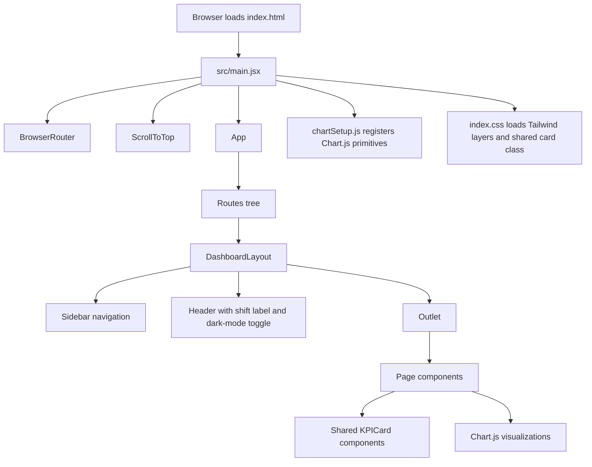
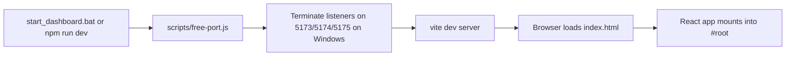
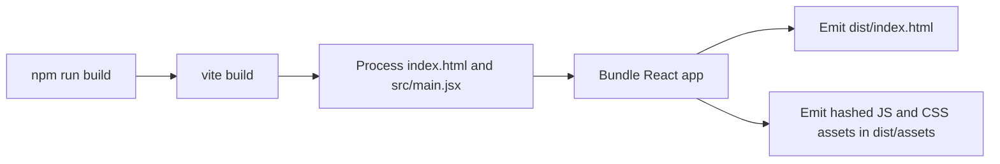
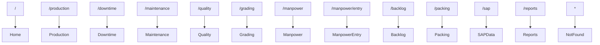

# FactoryOS Technical Documentation

## 1. System Summary

FactoryOS is a Vite-hosted React single-page application that renders a manufacturing operations dashboard. Its current implementation is static and frontend-only. Every page is composed from local JSX, local arrays/objects, shared Tailwind utility classes, and Chart.js visualizations. There is no API integration, data persistence layer, or server-side rendering path in the verified codebase.

## 2. Repository Structure

```text
FactoryOS/
|-- index.html
|-- package.json
|-- package-lock.json
|-- postcss.config.js
|-- tailwind.config.js
|-- vite.config.js
|-- start_dashboard.bat
|-- scripts/
|   `-- free-port.js
|-- src/
|   |-- main.jsx
|   |-- App.jsx
|   |-- chartSetup.js
|   |-- index.css
|   |-- components/
|   |   |-- KPICard.jsx
|   |   `-- ScrollToTop.jsx
|   |-- layouts/
|   |   `-- DashboardLayout.jsx
|   `-- pages/
|       |-- Home.jsx
|       |-- Production.jsx
|       |-- Downtime.jsx
|       |-- Maintenance.jsx
|       |-- Quality.jsx
|       |-- Grading.jsx
|       |-- Manpower.jsx
|       |-- ManpowerEntry.jsx
|       |-- Backlog.jsx
|       |-- Packing.jsx
|       |-- SAPData.jsx
|       |-- Reports.jsx
|       `-- NotFound.jsx
`-- dist/                Generated build output, not source-of-truth
```

## 3. Architecture



## 4. Runtime and Build Flow

### 4.1 Development startup



### 4.2 Production build



## 5. End-to-End Data Flow

There is one verified data pattern across the codebase:

1. A route is selected by React Router.
2. `DashboardLayout` renders persistent navigation and header chrome.
3. The matching page component renders.
4. Each page constructs local constants or local component state.
5. That local data is fed into JSX tables, KPI cards, and chart components.
6. Chart components consume pre-registered Chart.js primitives from `src/chartSetup.js`.

There are no network requests, no context providers, no reducers, no custom hooks beyond route scroll handling, and no cross-page shared state besides the `darkMode` state held in `App`.

## 6. Verified Module Behavior

### 6.1 Root and configuration files

| File | Category | Verified role |
| --- | --- | --- |
| `index.html` | USED | Provides the `#root` mount element and loads `/src/main.jsx`. |
| `package.json` | CRITICAL/INFRA | Defines dependencies and the `dev`, `build`, and `preview` scripts. |
| `package-lock.json` | CRITICAL/INFRA | Locks package resolution for reproducible installs. |
| `vite.config.js` | CRITICAL/INFRA | Enables React plugin and configures dev/preview ports. |
| `tailwind.config.js` | CRITICAL/INFRA | Defines Tailwind content scan targets, dark mode mode, and extended colors. |
| `postcss.config.js` | CRITICAL/INFRA | Wires Tailwind CSS and Autoprefixer into CSS processing. |
| `start_dashboard.bat` | USED | Windows entry script that installs dependencies and starts the dev server. |
| `.gitignore` | CRITICAL/INFRA | Excludes `node_modules/`, `dist/`, logs, and `.DS_Store`. |

### 6.2 Scripts

| File | Category | Verified role |
| --- | --- | --- |
| `scripts/free-port.js` | USED | Invoked by `npm run dev`; on Windows it finds listeners on requested ports and terminates their PIDs before Vite starts. |

### 6.3 Application bootstrap

| File | Category | Verified role |
| --- | --- | --- |
| `src/main.jsx` | USED | Mounts the React app, wraps it in `BrowserRouter`, injects `ScrollToTop`, and imports global chart/style setup. |
| `src/App.jsx` | USED | Owns the `darkMode` state, synchronizes the `dark` class on `document.documentElement`, and declares the full route tree. |
| `src/chartSetup.js` | USED | Registers all Chart.js elements used by page charts. |
| `src/index.css` | USED | Loads Tailwind layers, defines light/dark body styling, and introduces a reusable `.card` component class. |

### 6.4 Shared UI

| File | Category | Verified role |
| --- | --- | --- |
| `src/layouts/DashboardLayout.jsx` | USED | Renders sidebar navigation, route outlet, shift label, avatar stub, and dark-mode toggle. |
| `src/components/KPICard.jsx` | USED | Displays KPI title, value, unit, target, and icon with status color mapping. |
| `src/components/ScrollToTop.jsx` | USED | Resets scroll position on route change, preferring the main content scroll container when available. |

### 6.5 Route pages

| File | Category | Verified role |
| --- | --- | --- |
| `src/pages/Home.jsx` | USED | Plant overview dashboard with KPI cards, production trend, grade distribution, downtime summary, line status, and alert cards. |
| `src/pages/Production.jsx` | USED | Production page with shift/date filters, KPI cards, hourly trend, line-wise output, and line status table. |
| `src/pages/Downtime.jsx` | USED | Downtime page with KPI cards, pareto chart, and machine-wise incident table. |
| `src/pages/Maintenance.jsx` | USED | Maintenance page with machine state summaries, health doughnut chart, and PM tracker cards. |
| `src/pages/Quality.jsx` | USED | Quality page with KPI cards, yield trend chart, and defect distribution doughnut chart. |
| `src/pages/Grading.jsx` | USED | Grading page with grade summary cards and stacked grade trend bars. |
| `src/pages/Manpower.jsx` | USED | Manpower overview with navigation into the entry form, KPI cards, line cards, attendance chart, and utilization doughnut chart. |
| `src/pages/ManpowerEntry.jsx` | USED | Local-state manpower entry grid with editable required/present counts, derived shortage values, and aggregate totals. |
| `src/pages/Backlog.jsx` | USED | Backlog view with KPI cards, backlog bar chart, and pending order list. |
| `src/pages/Packing.jsx` | USED | Packing view with KPI cards, shift packing chart, and recent pallet table. |
| `src/pages/SAPData.jsx` | USED | Searchable SAP order table backed by local component state and hard-coded records. |
| `src/pages/Reports.jsx` | USED | Reports center showing selectable format/date UI and a list of report cards. |
| `src/pages/NotFound.jsx` | USED | Catch-all route page for unmatched URLs. |

## 7. Route Map



## 8. State and Interaction Model

### 8.1 Global-ish UI state

- `App.jsx` owns `darkMode`.
- `useEffect` in `App.jsx` adds or removes the `dark` class from `document.documentElement`.
- `DashboardLayout.jsx` toggles that state through the header button.

### 8.2 Route utility state

- `ScrollToTop.jsx` reads `pathname` from `useLocation`.
- On change, it scrolls the main content container back to the top, or the window if that container is absent.

### 8.3 Page-local state

- `ManpowerEntry.jsx` holds an editable array of row objects in `useState`.
- `SAPData.jsx` holds `searchTerm` in `useState` and derives `filteredOrders`.

## 9. Inputs and Outputs By Module

### 9.1 `src/App.jsx`

- Inputs:
  - Browser route from React Router.
  - User clicks on the dark-mode toggle.
- Outputs:
  - Selected page route element.
  - `dark` class on the root HTML element.

### 9.2 `src/layouts/DashboardLayout.jsx`

- Inputs:
  - `darkMode`
  - `setDarkMode`
  - Active route from React Router.
- Outputs:
  - Sidebar navigation UI.
  - Header UI.
  - Routed page outlet.

### 9.3 `src/components/KPICard.jsx`

- Inputs:
  - `title`
  - `value`
  - `target`
  - `unit`
  - `status`
  - `icon`
- Outputs:
  - Rendered KPI card with status-colored icon and target footer when provided.

### 9.4 `src/components/ScrollToTop.jsx`

- Inputs:
  - `pathname`
- Outputs:
  - Scroll reset side effect.

### 9.5 Page modules

Each page takes no props in the verified codebase. Each page outputs JSX composed from:

- hard-coded KPI values,
- hard-coded chart datasets,
- hard-coded status labels and tables,
- optional local component state for form or filter UI.

## 10. Technology Stack and Rationale

| Technology | Verified use | Practical rationale in this codebase |
| --- | --- | --- |
| Vite | Dev server and production bundling | Fast React development setup with minimal configuration. |
| React 18 | Component model and rendering | Suitable for composing dashboard sections and route pages from reusable JSX blocks. |
| React Router DOM 6 | SPA navigation | Clean nested route model with a shared dashboard shell and per-page outlets. |
| Tailwind CSS | Styling | Enables rapid utility-based dashboard layout and supports dark mode via class toggling. |
| PostCSS + Autoprefixer | CSS processing | Required for Tailwind compilation and cross-browser prefixing. |
| Chart.js | Chart engine | Supplies line, bar, and doughnut visualizations used across dashboard pages. |
| `react-chartjs-2` | React wrapper for Chart.js | Simplifies embedding Chart.js instances inside React components. |
| Lucide React | Icons | Provides lightweight SVG icons for navigation, KPI cards, and action buttons. |
| Windows batch + Node child process utilities | Local startup ergonomics | Adds a Windows-first launch path and port cleanup helper for predictable local runs. |

## 11. Audit and Cleanup Result

### 11.1 Deterministic classification summary

| Item | Category | Proof |
| --- | --- | --- |
| All tracked files returned by `git ls-files` | USED or CRITICAL/INFRA | Every tracked source file is directly referenced by the route graph, boot chain, CSS pipeline, build config, or startup scripts. |
| `node_modules/` | CRITICAL/INFRA | Needed to execute `npm run dev` and `npm run build`; excluded from version control but required for the local environment. |
| `dist/` | UNUSED | Generated by `vite build`, ignored by `.gitignore`, not imported by any tracked source file, and not used by the documented dev startup path. |

### 11.2 Deleted item

- `dist/`

### 11.3 Preserved items

- All tracked files.
- `node_modules/`.

### 11.4 Uncertain items

- None in the verified tracked code graph.

## 12. Known Functional Limits

- Buttons that imply side effects currently do not dispatch network calls or file exports.
- Charts and tables do not refresh from live plant data.
- `start_dashboard.bat` performs `npm install` on every run, which is convenient but slower than a one-time install.
- Dark mode does not persist across reloads.

## 13. Recommended Extension Points

If this dashboard is converted from a demo shell into a production system, the cleanest integration points are:

1. Replace page-local constants with API-backed query hooks or loader functions.
2. Persist user preferences such as theme and selected shift.
3. Connect action buttons to report/export services.
4. Add linting and automated tests to catch dead imports and route regressions earlier.

## 14. Validation Performed

- Verified the tracked file list with `git ls-files`.
- Verified route references from `src/App.jsx`.
- Verified shared bootstrap references from `src/main.jsx`.
- Verified startup script references from `package.json` and `start_dashboard.bat`.
- Removed one dead import from `src/pages/Quality.jsx`.
- Deleted the generated `dist/` directory as the only definitively unused project artifact.
